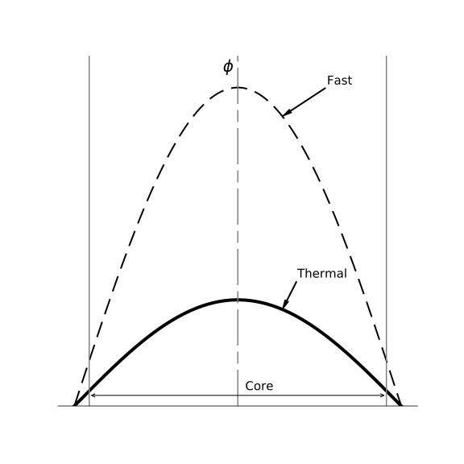

---
uuid: flux-distribution-homo-reactor-review
title: Review of Reactor Flux Distributions in Homogenous Reactors
prerequisites:
  - 2grp-neutron-diffusion-solns-bare-homogeneous-reactors
learning-objectives:
  - recall the characteristic axial shape for a cylindrical homogenous reactor
  - recall the characteristic axial shape for a infinite slab homogenous reactor
  - recall the characteristic axial shape for a spherical homogenous reactor
references:
  - el-wakil.bib
assessments: 
  - 
...

# Flux Distributions in Bare Homogenous Reactors (Review)

The neutron flux distribution in bare homogenous reactors is often described
analytically by neutron diffusion with two neutron energy groups.  For a bare
reactor, the solution to the fast (high energy) group flux and the thermal
(low energy) group flux have the same shape, but different magnitudes.

The mathematical shape of the solution depends on the geometric shape of the
reactor.  For bare reactors, a standard approximation of the vacuum boundary
condition is to set the solution to zero at an extrapolated distance.  Thus,
the dimensions of the mathematical system, \(\tilde{R}\), are slightly larger
than the dimensions of the physical system, \(R\).

Table X provides the standard shapes for some common geometries.

Table X

+--------------------------+---------------------------------------------------------------------------+
| Geometry                 |  Flux Distribution                                                        |
+--------------------------+---------------------------------------------------------------------------+
| infinite slab of         |  \(\cos \left( \frac{\pi x}{\tilde{a}} \left)\)                           |
| thickeness \(\tilde{a}\) |                                                                           |
+--------------------------+---------------------------------------------------------------------------+
| sphere of                |  \(\frac{\tilde{R}}{\pi r} \sin \left( \frac{\pi r}{\tilde{R}} \right )\) |
| radius \(\tilde{R}\)     |                                                                           |
+--------------------------+---------------------------------------------------------------------------+
| cylinder of              | axial: \(\cos \left( \frac{\pi z}{\tilde{H}} \left)\)                     |
| radius \(\tilde{R}\) and | radial: \(J_v \left( \frac{2.405 r}{\tilde{R}} \right )\)                 |
| height \(\tilde{H}\)     |                                                                           |
+--------------------------+---------------------------------------------------------------------------+

This figure show the shape of the solution for an infinite slab or the axial
dimension of a cylindrical reactor.

